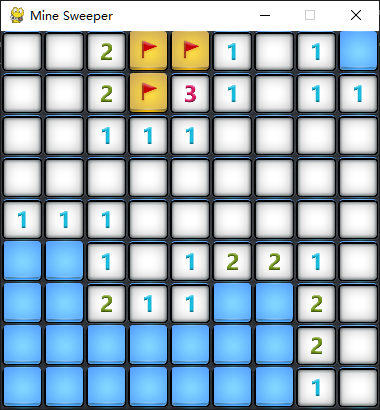

# MineSweeper
 A Mine Sweeper based on pygame for my own use. For GUI initialization, refer to main.py
 'Algorithm' and 'DQN' is two different solving algorithms, where 'Algorightm' is simple DFS and 'DQN' is implemented by Reinforcement Learning.

